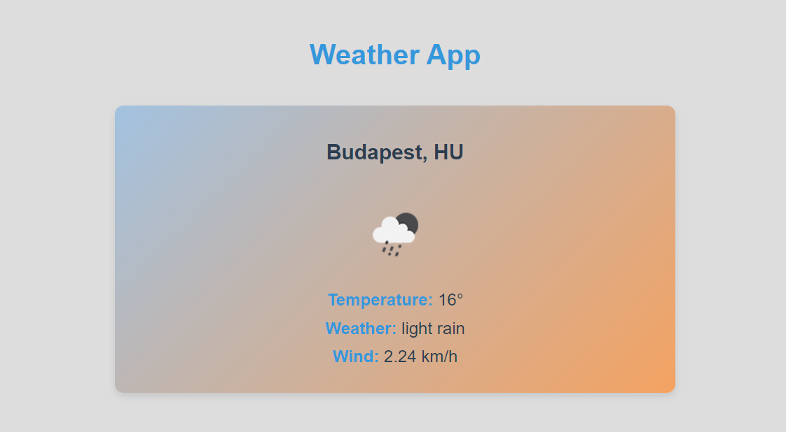

Weather App

## This application displays real-time weather information using the [OpenWeather API](https://openweathermap.org/api). Built with Express.js and EJS, the app provides a simple and user-friendly interface for viewing current weather conditions.

### Features:

- Displays current weather for a selected location, including temperature, weather description, and wind speed.
- Weather icons are dynamically updated with the latest data.
- Elegant gradient background and design enhance the user experience.

### Technologies Used:

- **Express.js**: A fast, unopinionated, minimalist web framework for Node.js that handles server-side routing and logic.
- **EJS**: A templating engine that allows embedding JavaScript logic into HTML for dynamic content rendering.
- **OpenWeather API**: Provides real-time weather data including temperature, weather descriptions, and icons.
- **CSS**: Used for styling the application, including modern gradients and responsive design.
- **Axios**: A promise-based HTTP client for making API requests.
